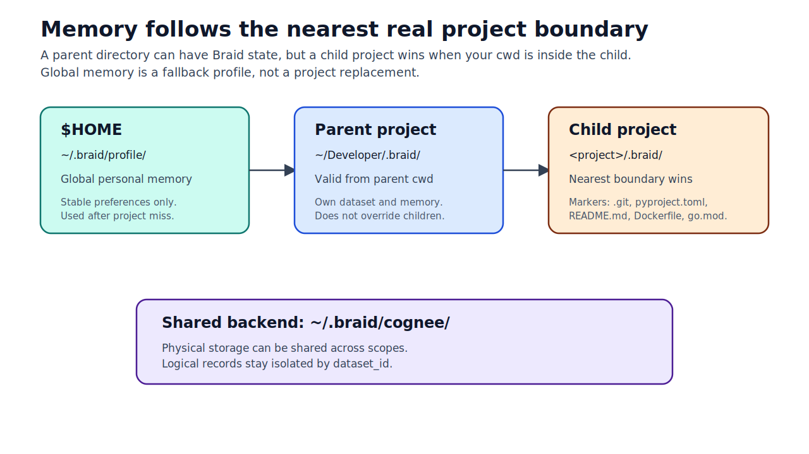
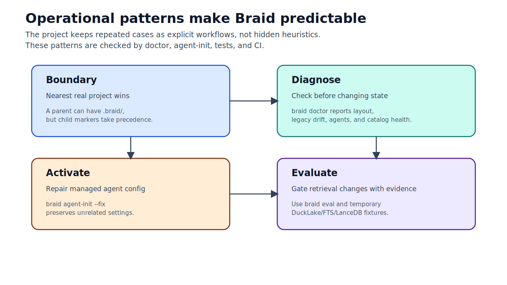
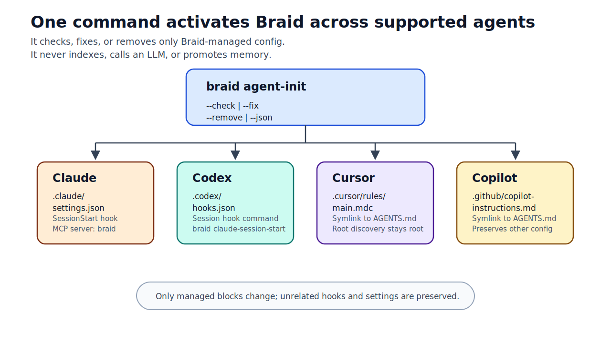
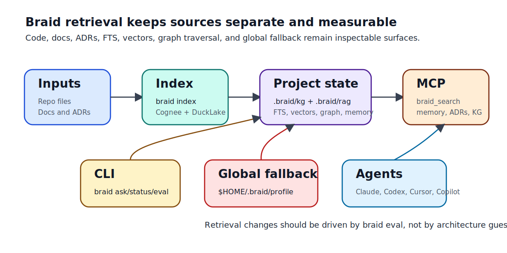

# Braid

MCP-first persistent memory, Knowledge Graph, and RAG for coding agents.

Braid gives Claude Code, Codex, Cursor, Copilot, and other AI development
tools a repo-scoped memory layer that is grounded in the project you are
actually working on. It keeps project context, global preferences, ADRs, code
structure, retrieval indexes, and agent discovery files organized without
turning every repository root into a pile of hidden runtime folders.



## Why Braid Exists

AI coding agents are useful only when they can answer from the real repository:
the code, the decisions, the local conventions, and the documentation that are
present now. Braid is built for that workflow.

Braid is not a SaaS, a team platform, or a replacement for an IDE. It is a local
project companion that feeds existing agents through CLI commands, hooks, MCP
tools, and stable root discovery files.

The core goals are:

- keep project memory tied to the active project, not to a random parent folder;
- keep global personal memory separate from project memory;
- expose search, ADRs, KG, and memory through MCP-first tools;
- require explicit promotion for durable memory;
- keep generated operational state under `.braid/`;
- leave root-level agent discovery files where external tools expect them.

## Memory Boundaries

Braid separates memory by scope. A parent directory can have its own Braid
context, and a child project can also have one. When you work inside the child,
the child wins because it is the nearest real project boundary.

| Scope | Canonical location | Purpose |
| --- | --- | --- |
| Session | process/runtime only | Temporary context for the current agent session. |
| Project | `<project>/.braid/` | Repo decisions, ADRs, KG, RAG, evals, and generated wiki output. |
| Global profile | `$HOME/.braid/profile/` | Stable personal preferences used only as fallback. |
| Shared Cognee backend | `$HOME/.braid/cognee/` | Shared backend storage, always separated by `dataset_id`. |

Resolution is intentionally strict:

```text
cwd
  -> nearest real project boundary
  -> <project>/.braid/config.toml
  -> legacy .kgconfig/.kg only in that same boundary, read for migration
  -> $HOME/.braid/profile/ only as final fallback
```

`~/Developer/.braid/` may be valid when you are intentionally working from
`~/Developer`, but it must not override `~/Developer/some-child-project/.braid/`
or a child project with its own markers such as `pyproject.toml`,
`requirements.txt`, `package.json`, `Dockerfile`, `.sln`, `go.mod`, `Cargo.toml`,
or `README.md`.

## Project Layout

Project-local operational state lives under `.braid/`:

```text
.braid/
  config.toml
  kg/
  rag/
  memory/
    MEMORY.md
    decisions/
    plans/
    eval/questions.json
    eval/runs/
  wiki/
```

Root-level discovery files stay at the repository root because external agents
look for them there:

```text
AGENTS.md
CLAUDE.md -> AGENTS.md
.cursor/rules/main.mdc -> ../../AGENTS.md
.github/copilot-instructions.md -> ../AGENTS.md
```

Do not move those files into `.braid/`. They are part of the cross-agent
contract, not rebuildable runtime state.

## Operational Patterns

Braid treats recurring repo-memory problems as explicit operational patterns,
not hidden heuristics. These patterns are intentionally implemented through the
existing commands and tests instead of a new CLI surface.



| Pattern | How Braid applies it |
| --- | --- |
| Boundary | The nearest real project boundary wins. A parent such as `~/Developer` may have `.braid/`, but a child project with markers owns its own context. |
| Diagnose | Run `braid doctor` before changing state. It reports path resolution, layout, legacy drift, agents, secrets, GitHub remote, and catalog health. |
| Activate | Run `braid agent-init --fix` to repair only Braid-managed agent config while preserving unrelated settings. |
| Isolate | DuckLake, FTS, and LanceDB tests use temporary catalogs and never depend on the real local `.braid/kg` catalog. |
| Evaluate | Retrieval changes are gated by `braid eval` evidence, not by architecture guesses. |

## Quick Start

From the Braid checkout:

```bash
uv venv
uv pip install -e ".[ducklake,mcp,test]"
```

For Cognee-backed indexing, install the Cognee extra as well:

```bash
uv pip install -e ".[cognee,ducklake,mcp,test]"
```

Then initialize the project you want Braid to remember:

```bash
cd ~/Developer/my-project
braid init
braid doctor
braid agent-init --fix
braid index
braid status --json
```

For a local development checkout, the editable install remains:

```bash
uv pip install -e ".[cognee,ducklake,mcp,test]"
```

For day-to-day use from any repository, prefer a tool-style install once the
package source is on your machine:

```bash
uv tool install --editable ~/Developer/braid
braid doctor
```

Ask from the active project:

```bash
braid ask "What does this repository do?"
```

Run the MCP server for tools that consume Braid through MCP:

```bash
braid mcp-serve
```

## Agent Activation

`braid agent-init` is the universal activation command for supported coding
agents. It is idempotent and does not index the repository, call an LLM, or
promote memory.



Common usage:

```bash
braid agent-init
braid agent-init --check --json
braid agent-init --fix
braid agent-init --remove
braid agent-init --agent claude --fix
braid agent-init --agent codex --fix
braid agent-init --agent cursor --check
braid agent-init --agent copilot --check
```

What it manages:

| Agent | Managed integration |
| --- | --- |
| Claude | `.claude/settings.json`, `SessionStart` hook, and MCP server `braid`. |
| Codex | `.codex/hooks.json` hook invoking `braid claude-session-start`. |
| Cursor | `.cursor/rules/main.mdc` discovery symlink to `AGENTS.md`. |
| Copilot | `.github/copilot-instructions.md` discovery symlink to `AGENTS.md`. |

`braid claude-init` remains as a compatibility command and delegates to
`braid agent-init --agent claude`.

## Retrieval Flow

Braid combines local project resolution, human-authored memory, ADRs, DuckLake
FTS, optional vector retrieval, graph traversal, and MCP tools. The important
part is not that every retrieval surface exists; it is that they remain
separate enough to measure and debug.



The current MCP server exposes:

| MCP tool | Purpose |
| --- | --- |
| `braid_search` | Search active-project context through DuckLake/Cognee retrieval. |
| `braid_memory` | Read, write, or search session/project/global memory levels. |
| `braid_adrs` | List or search project ADRs. |
| `braid_status` | Return project, catalog, memory, and ADR status. |
| `braid_kg` | Traverse a local KG subgraph from a node. |

## CLI Surface

| Command | Purpose |
| --- | --- |
| `braid init` | Create `.braid/`, config, memory folders, `AGENTS.md`, and discovery symlinks. |
| `braid index` | Ingest code and documentation into the active project dataset. |
| `braid ask "<query>"` | Query the active project or global profile from the CLI. |
| `braid promote-decision "<text>"` | Promote a session decision into project ADR memory. |
| `braid promote-to-global <decision_id>` | Promote a project decision to the global profile. |
| `braid demote --id <decision_id>` | Move a promoted ADR out of the active decision set. |
| `braid sync` | Reconcile filesystem state with the index. |
| `braid eval` | Run grounding and recall evaluation questions. |
| `braid wiki build` | Generate Markdown wiki output under `.braid/wiki/`. |
| `braid status --json` | Print active project and memory status as stable JSON for agents. |
| `braid doctor` | Diagnose installation, context, agent drift, secrets, GitHub remote, and catalog health without indexing or LLM calls. |
| `braid agent-init` | Apply, check, fix, or remove supported agent integrations. |
| `braid claude-session-start` | Fast hook command for agent session startup. |
| `braid mcp-serve` | Start the Braid MCP server over stdio. |

Historical `fairlead` and `wikiforge` console scripts are transitional legacy
aliases only. They warn and delegate to `braid`.

## Safety Rules

Braid is deliberately conservative:

- no automatic memory promotion;
- no cross-project memory mixing by default;
- no writes to legacy `.kg`, `.rag`, `.memory`, or `.kgconfig` paths;
- no `braid index` from `agent-init`;
- no LLM calls from `agent-init` or `claude-session-start`;
- no cloud upload of private documents unless explicitly authorized for that
  ingestion.

Runtime outputs that can be rebuilt belong under `.braid/kg/`, `.braid/rag/`,
and `.braid/wiki/`. Human-reviewed project memory belongs under
`.braid/memory/`.

## Development

Run the full test suite from the repository checkout:

```bash
PYTHONPATH=src .venv/bin/python -m pytest -q
```

Useful local checks:

```bash
PYTHONPATH=src .venv/bin/python -m braid.cli --help
PYTHONPATH=src .venv/bin/python -m braid.cli status --json
braid doctor --json
braid agent-init --check --json
git diff --check
```

DuckLake tests should use temporary catalogs and must not depend on a real local
`.braid/kg` catalog.

## Diagnostics

`braid doctor` is the first command to run when a project looks misconfigured.
It checks path resolution, `.braid/` layout, legacy drift, agent hooks, JSON
config validity, secrets, GitHub remote identity, and DuckLake availability.

```bash
braid doctor
braid doctor --json
braid doctor --fix
```

`doctor` does not run `braid index`, call an LLM, or promote memory. `--fix` is
limited to local Braid-managed repairs such as safe `.braid/` directory creation
and agent integration repair.

## Recommended Next Improvements

Retrieval architecture changes should wait for evidence from `braid eval`. If
grounding, recall, or reranking fails in measurable ways, the change should be
documented with an ADR and validated against temporary DuckLake/Cognee fixtures
before touching live project catalogs.

A future `braid patterns` command may be useful if these operational patterns
need machine-readable reporting beyond `doctor --json`, but it should be added
only with a new ADR, tests, and a stable JSON interface.

## Status

- Phase 0: repository-grounded recall baseline.
- Phase 1: CLI, governance, and manual promotion flow.
- Phase 2: evals, DuckLake catalog, reranking, and quality measurement.

See `AGENTS.md` for the canonical architecture and `.braid/memory/MEMORY.md` for
the operational memory index.
